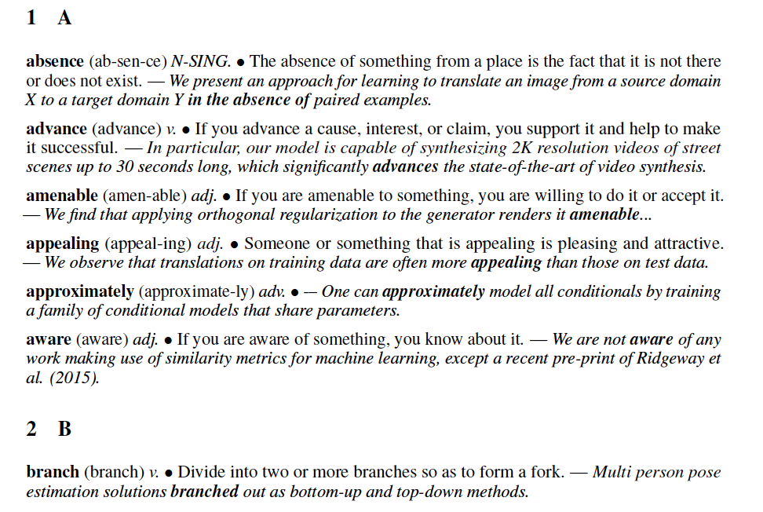

## Readme 

The read-only link at [overleaf.com](https://www.overleaf.com/read/dgzbqvhjhbvq).

I believe a good paper deserves a good representation, to name the expressive words. This is an interest-motivated project that collects *good* words mainly from computer-vision papers. 

The idea initially came into my mind when I read [Chris A. Mack, How to Write a Good Scientific Paper](https://spie.org/samples/9781510619142.pdf)
 at 2016.
 
 You are welcome to contribute the project with words you like via opening an issue, pulling a request, emailing me at *feiw2 dot ri at gmail dot com*, etc. 

